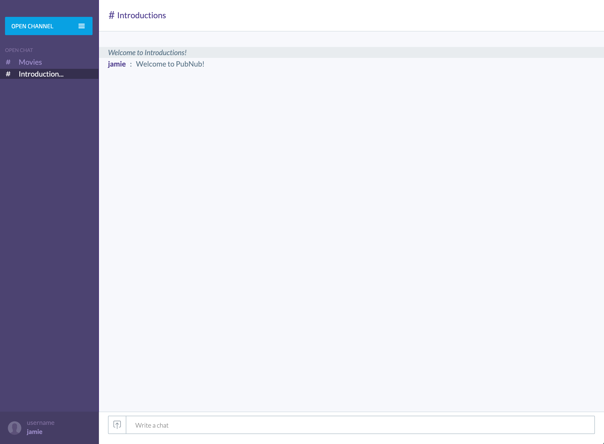

# Web Chat



## Run the App

1. Download the github repo.

```bash
git clone https://github.com/nishith-pubnub/web-chat.git
cd web-chat
```

2. Install

```bash
npm install
```

4. Run

```bash
npm start
```

Go to: http://127.0.0.1:9001/
